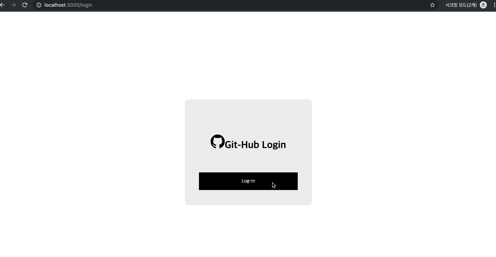
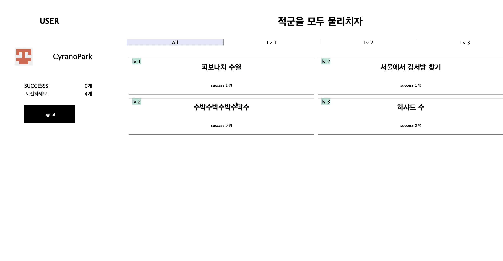
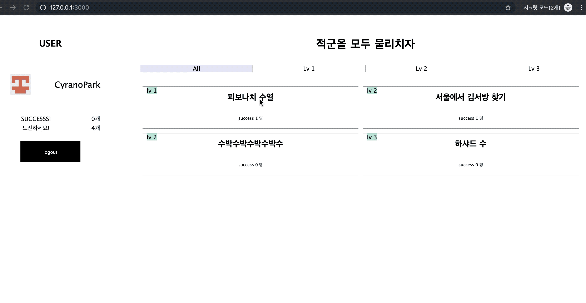

# welcome-Codewars

[Codewars](https://codewars.com)와 같이 등록되어 있는 알고리즘 문제를 풀 수 있는 어플리케이션입니다.

## Setup

```sh
yarn install or npm install
```

## Development

```sh
yarn run dev or npm run dev
```

## END POINT

### 1. GET '/'
  - 로그인이 되어 있는 상태이면 알고리즘 리스트를 볼 수 있습니다.
  - 로그인이 되어 있지 않으면 `/login` 페이지로 이동합니다.
  - 자신의 github 프로필 사진과 이름을 확인할 수 있습니다.
  - 자신이 푼 문제와 안 푼 문제를 리스트 상에서 확인할 수 있습니다.
  - 레벨 별로 알고리즘 문제를 sorting하여 볼 수 있습니다.
  - 자신이 몇 문제를 풀었는지 볼 수 있습니다.
  - `logout` 버튼을 누르면 logout할 수 있습니다.
  - 각 알고리즘 문제 리스트에서는 '문제 이름', '문제 난이도', '성공한 사람의 수', 'user의 해당 문제 성공여부'를 확인할 수 있습니다.
  - 각 알고리즘 문제를 클릭하면 `/problems/:problem_id` 페이지로 이동합니다.

### 1. GET `/login`
  - GitHub Social Login이 가능합니다.
  - login 버튼을 누르면 GitHub Login페이지로 넘어갑니다.
  - login이 완료되면 root page('/')로 이동합니다.

### 3. GET `/problems/:problem_id`
  - 문제의 상세정보(문제 이름, 정답자 수, 문제 레벨, 그리고 문제에 대한 설명 등)를 확인할 수 있습니다.
  - 우측에 에디터에서 코드를 작성할 수 있습니다.
  - `submit`버튼으로 에디터에 작성한 코드를 제출할 수 있습니다.

### 4. POST `/problems/:problem_id`
  - 클라이언트로부터 제출받은 코드 정보를 데이터베이스의 정답 코드를 이용하여 정답이 모두 일치하는지 판별합니다.
  - 제출한 코드가 통과했을 경우, 성공 축하 페이지로 이동합니다.
  - 성공 축하 페이지에서는 home으로 돌아갈 수 있습니다.
  - 제출한 코드가 실패했을 경우, 실패 페이지로 이동합니다.
  - 실패 페이지에서는 실패한 사유를 확인하고 문제 상세 페이지로 다시 이동할 수 있습니다.
  - 코드에 오류가 있을 경우 오류 사유를 확인할 수 있습니다.

### 5. GET `/error`
  - 유효하지 않은 URL로 들어왔을 경우, 404 Not Found 메시지를 표기합니다.
  - 서버 내부적인 문제가 발생했을 경우, 500 Internal Server Error 메시지를 표기합니다.

### 6. EXAMPLES




