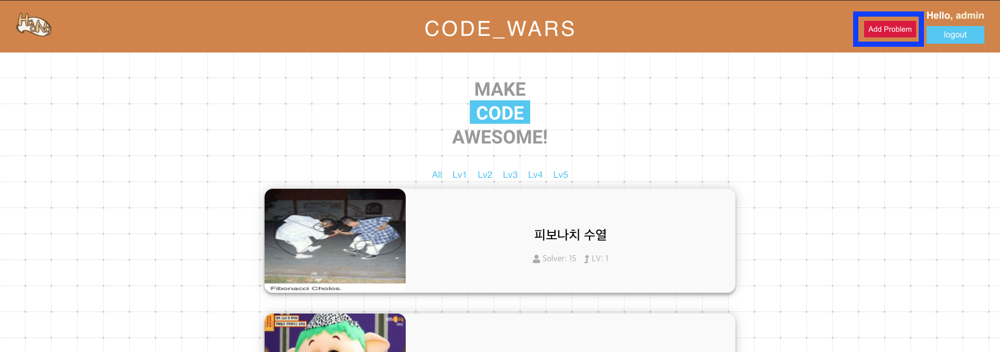
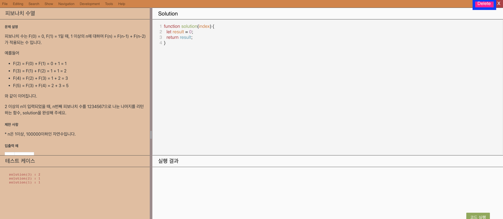
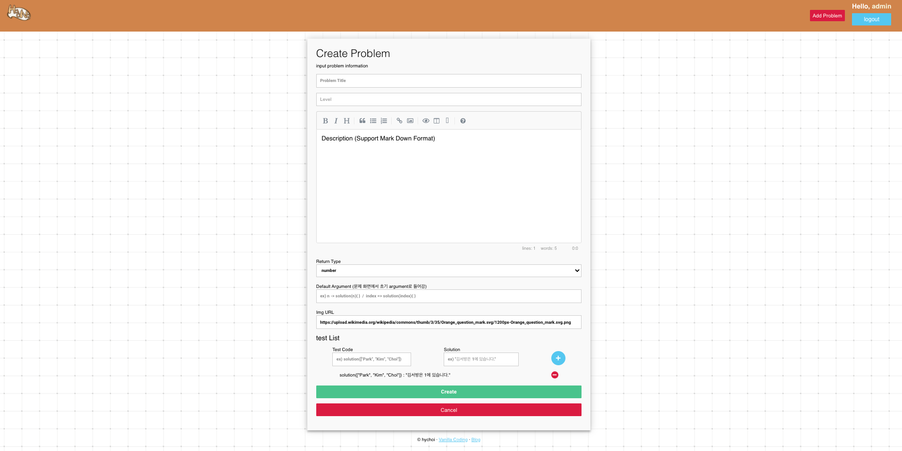
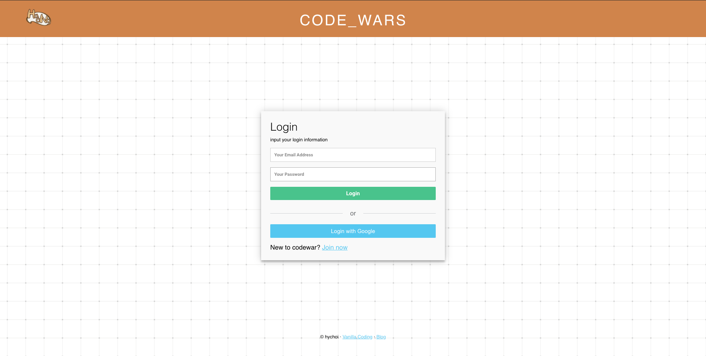
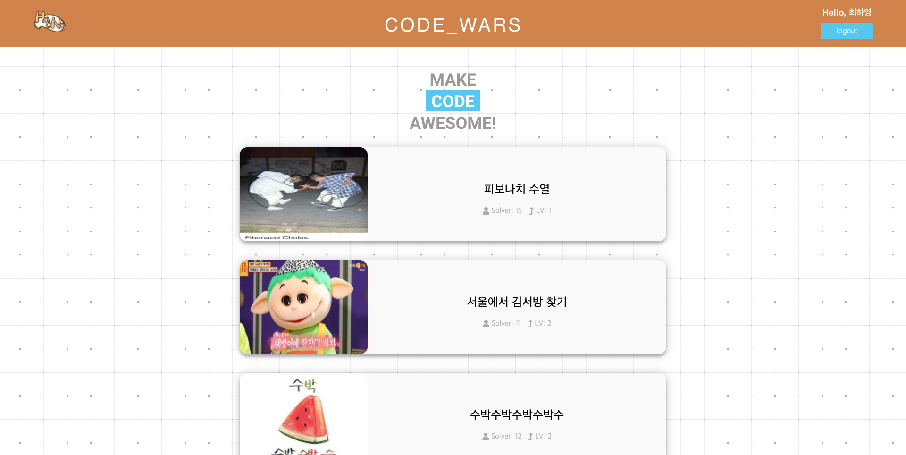
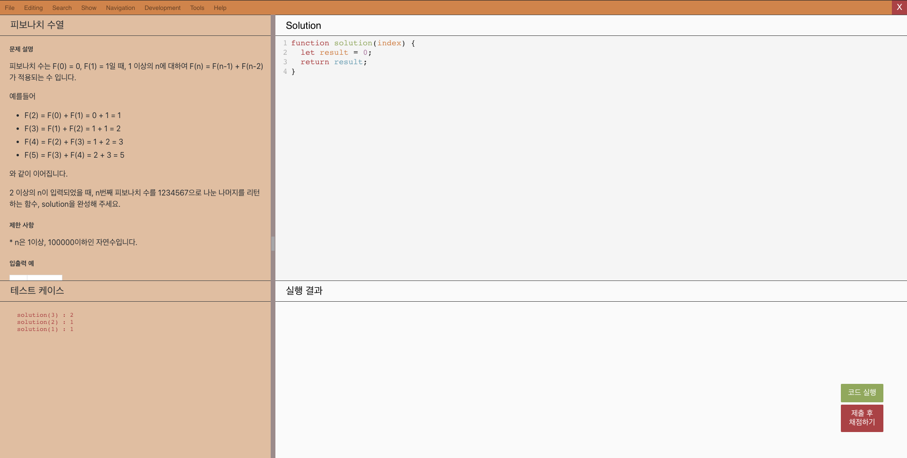
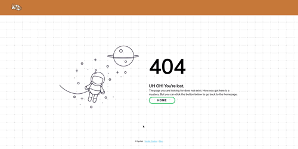
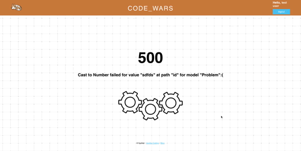

### [배포 링크](https://vaco-codewar.herokuapp.com/)

### 2021.03.29 추가
#### 문제 리스트 추가
- email : admin@admin.com
- password: admin

admin 계정으로 로그인 시 가능

추가 : 메인화면 우측 상단에서 추가

삭제 : 문제페이지 우측 상단 Delete 버튼 클릭

문제 추가 화면

## 설명

안녕하세요 프로그래머스 사이트의 기능을 최대한 구현하는 식으로 하였습니다.

좌측 문제 설명과 우측 코드 작성, 하단의 실행결과와 같이 UI 구조는 동일하고,

테스트 케이스를 추가해서 확인 및 정답 제출 및 체점 기능까지 동일합니다.

> 출력 확인 및 정답과 틀린 답 비교, 시간체크 기능 또한 같습니다.

저는 이번 과제에서 로그인, 문제리스트 보다는 문제 풀이 화면의 기능에 집중했던 것 같습니다.

### 어려웠던 점

서버쪽 express와 node js를 사용해서 앱을 내손으로 처음 만들어보고 ejs등과 같은 것들은 처음 다루다보니 굉장히 많이 헤맸던 것 같습니다.

특히 서버쪽 코딩과 public에 위치한 javascript파일의 연관이 전혀없다는 것을 이해하는데 좀 걸렸던 것 같습니다.

> 덕분에 front, back 구조에 대해서 더 잘 이해하게 된 것 같습니다.

저는 로그인을 passport를 사용한 session을 사용하지 않고 json web token을 사용해서 로그인 기능을 구현했는데,

사용하면서 passport는 session쪽에 특화되어있는 기능이지 json web token과 어울리지 않고 억지로 끼워쓰는 느낌을 많이 받았습니다.

처음에 구현하면서 passport로 json web token 로그인 기능을 구현하는 것이 구조적으로 이해하기가 많이 어려웠던 것 같습니다.

이후 문제풀이 기능에서 프로그래머스와 같이 테스트케이스로 문제 확인을 하고 제출 및 체점기능을 넣으려고 하였으나,

post로 테스트케이스 확인, 제출 및 체점기능을 하고 그 결과를 가지고 다시 랜더링을 하다보니 페이지가 새로고침되어서 뒤로가기시에 매우 많은 history가 쌓여서 너무 불편하게 되었습니다.

이후 켄님과 상의 후 ajax로 하는 것으로 결정하였고 지금은 문제풀이 버튼에 의한 작동은 모두 ajax로 작동합니다.

모두 갈아엎고 다시 개발하는 것이 힘들긴 했지만 결과물을 보니 매우 기분이 좋은 것 같습니다.

그리고 맨 처음 [3 Layer Architecture](https://softwareontheroad.com/ideal-nodejs-project-structure/#architecture) 라는 것을 알게되어서 적용시키려 하였으나 구현에 급급해 우선 구조자체를 따지지 않고 개발을 진행하였습니다. 추후 미구현 사항은 주말에 구현 할 예정입니다.

> 지금 현재 구조와 코드는 매우 복잡하고 관심사 분리도 되어있지않고 상수처리도 되어있지 않지만 모두 다! 할 예정입니다!

우선 최우선순위로 꼽았던 기능들은 모두 구현을 하였지만 목표로 했던 기능들 구현은 모두 못해서 많이 아쉽습니다.

그리고 벡앤드는 처음에 흥미를 느끼지 못해 특히 힘들었습니다. ejs는 정말... 마주치고 싶지 않더군요.

리액트가 정말 그립습니다. ejs 보다는 리덕스가 더 좋습니다.

## 기능

### 로그인

- 로그인이 되어 있지 않다면 (json web token이 쿠키에 없다면) Login페이지로 리다이렉트 됩니다.
- 회원가입은 현재 Local로만 가능합니다.
- 회원가입시 패스워드는 bcrypt로 암호화되서 저장됩니다. (걱정 마시고 회원가입 해주세요!)
  - form submit(클라이언트사이드)시 에는 암호화되지않고 전송됩니다.
- 로그인 시에 먼저 email을 확인하고 db에 없는 email이면 없는 email 애러를 form에 보여줍니다.
- 비밀번호가 틀리면 비밀번호가 틀렸다고 form에 보여줍니다.
- 로그아웃은 우측 상단에서 가능합니다.

### 문제리스트

- 문제 리스트들이 나열됩니다.

### 문제풀이 화면

- 문제의 이미지, 테이블 등의 html tag 포함하여 description 뷰잉 가능

- 테스트케이스 추가 가능 (정해진 양식에 맞게 추가해야 됩니다)

  - solution( **arg** ) : **answer**

- 문제 description과 코드 너비 조절 가능 (split-bar)

- 우측하단 버튼

  - 코드실행 : 좌측 하단의 테스트케이스를 실행 및 결과와 비교
    - string, boolean, number 타입 비교 가능
    - 콘솔 출력결과를 확인할 수 있음
    - 값이 다를 경우 정답과 실행 결과 비교 가능
  - 제출 후 체점하기 : 서버가 가지고 있는 정답 케이스들을 비교해서 결과 출력
    - 시간 측정 가능
    - 성공, 실패 유무 판단

### 404 page

### error page

### 미완료 사항

- [x] 문제 Lv별로 보기
- [ ] 깃헙 소셜 로그인
- [x] 문제 추가 페이지
- [ ] 코드 분류시키기
- [ ] 문제에 시간초과 기능 추가
- [ ] 3Layer Structure구조 적용하기
- [ ] json web token refresh
